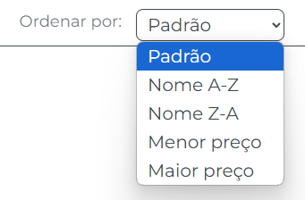
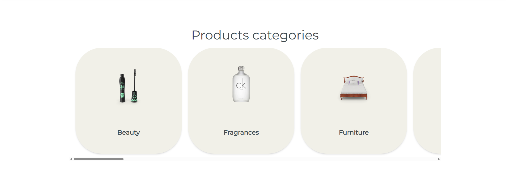
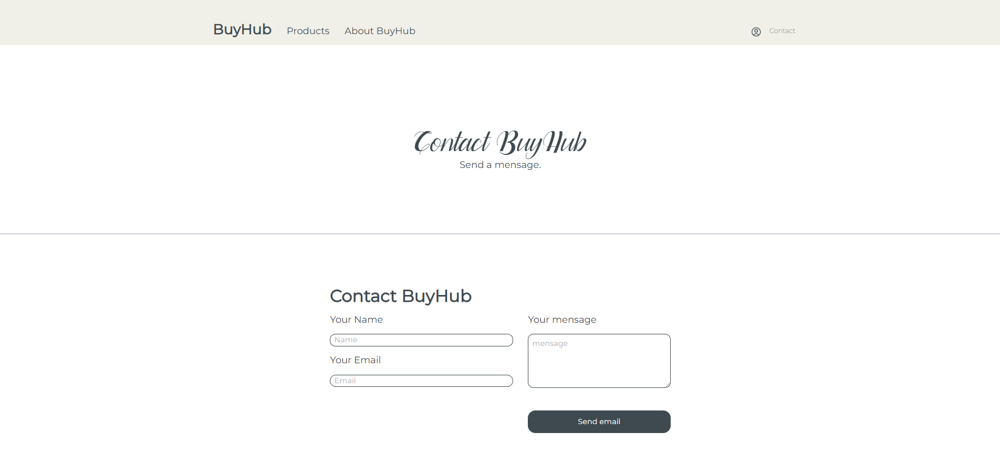

# BuyHub

## Descrição do Projeto

Este projeto é uma aplicação web desenvolvida com **Vue.js 3**, que simula uma loja virtual e consome dados de produtos em tempo real através da API pública do DummyJSON:  
[https://dummyjson.com/docs/products](https://dummyjson.com/docs/products)

Funcionalidades implementadas:

- NavBar:

- Listagem de produtos com dados da API:

- Visualização de detalhes de produtos:

- Filtro por categorias: <br>

- Busca por ordenação: <br>

- Navegação entre categorias: <br>

- Contato:


---

## Tecnologias Utilizadas

- Vue.js 3
- Vite
- Axios
- TailwindCSS

---

## Como rodar o projeto localmente

### Pré-requisitos

- Node.js
- Git

### Instalação

Clone o repositório:

```sh
git clone https://github.com/Caua94/CJ_E-commerce

cd CJ_E-commerce
```
Instale as dependências:
```sh
npm install
```
Inicie o servidor:
```sh
npm run dev
```

## Demonstração em Vídeo

https://www.youtube.com/watch?v=Gil7wdDlQG8

---

Feito por: <br>
Cauã Reginato RA: 1988923  <br>
Jhonata Gabriel Canevare RA: 1993374